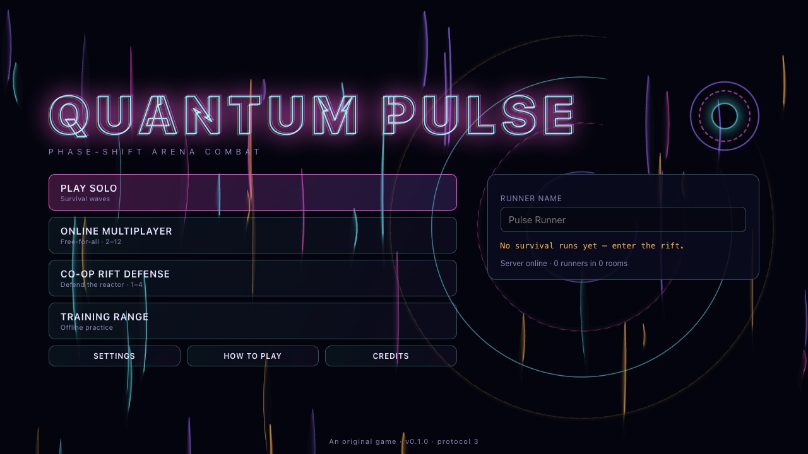
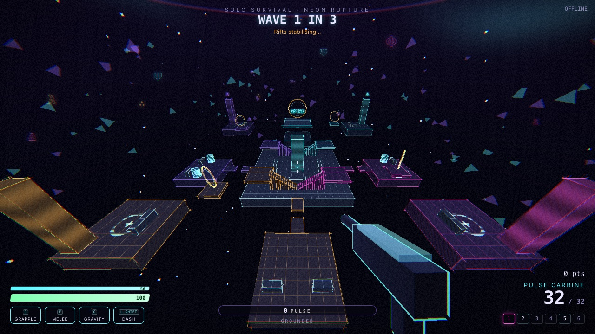
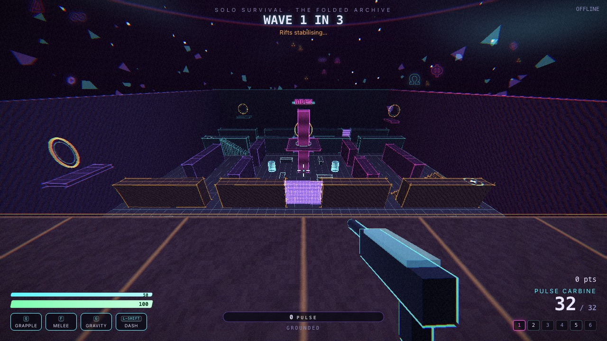
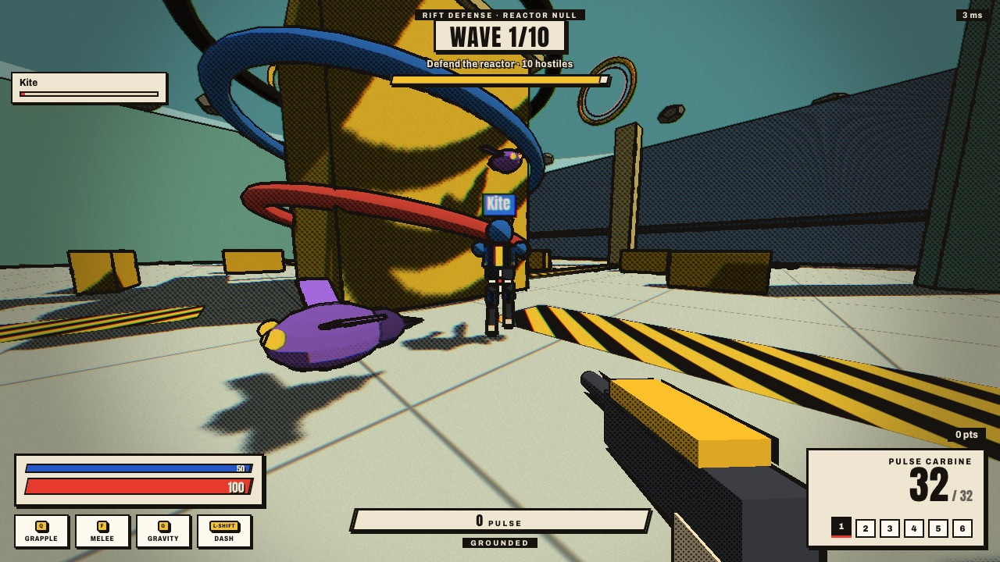
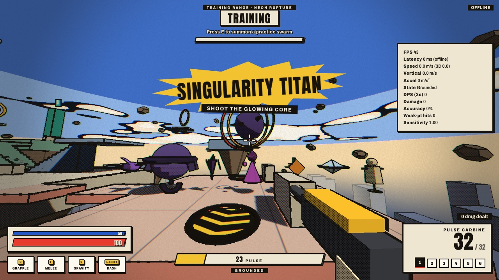

# QUANTUM PULSE

> **Phase-shift arena combat in your browser.** Grapple through quantum rings, tear open gravity fractures, and break reality with a well-timed Phase Break. Drawn like a living comic book: every character, arena and effect is generated in code, and all audio is synthesised.



Quantum Pulse is an original, fast-paced first-person arena shooter built with Three.js and Node.js. You play a **Pulse Runner**, fighting through unstable arenas that phase between versions of reality. You can survive escalating waves alone, fight up to 11 other runners in a server-authoritative free-for-all, or defend a quantum reactor with up to three friends.

| Neon Rupture | The Folded Archive | Reactor Null (co-op) |
| --- | --- | --- |
|  |  |  |



---

## Contents

- [Features](#features)
- [How to play](#how-to-play)
- [Controls](#controls)
- [Game modes](#game-modes)
- [Technical architecture](#technical-architecture)
- [Networking model](#networking-model)
- [Security model](#security-model)
- [Performance](#performance)
- [Getting started](#getting-started)
- [Configuration](#configuration)
- [Deployment](#deployment)
- [Browser compatibility](#browser-compatibility)
- [Troubleshooting](#troubleshooting)
- [Testing](#testing)
- [Project structure](#project-structure)
- [Roadmap](#roadmap)
- [Contributing](#contributing) · [License](#license) · [Originality](#originality-and-attribution)

---

## Features

**Movement**
- Acceleration-based ground movement with momentum preservation in the air
- Sprint, slide, slide-jump, wall-run and wall-jump
- Air dash with one charge per airtime, refilled on landing or by a wall-jump
- Grapple that can swing, reel and launch. It also latches onto quantum rings.
- Coyote time, jump buffering, automatic step-up and ledge mantling ("ledge forgiveness")
- Launch pads and hard-landing shockwaves
- Explicit movement state machine: Grounded, Falling, Jumping, Sliding, Wall-running, Grappling, Dashing, Phase-shifted, Stunned, Dead

**Quantum systems**
- **Pulse Charge (0–100)**, earned through skilled play: damage, kills, airborne kills, weak-point hits, near-miss dodges, flying through rings, sustained speed, kill combos and environmental kills. Gains are capped per second.
- **Phase Break** (`X` at 100 charge): 3.2 s in a parallel layer. Enemy projectiles pass through you and are drawn as delayed afterimages. Other damage is reduced by 60%, and blue hatched phase barriers become passable. It is strongly telegraphed with a screen ripple, a tint and a sound.
- **Gravity Fractures**: attract, repel and orbit fields that act on players, enemies, projectiles and pickups. They use a documented, clamped fixed-step force model ([`src/shared/gravity.js`](src/shared/gravity.js)).
- **Momentum combat**: damage scales with speed (capped at +30%). Hard landings create shockwaves, slides stagger light enemies, and grapple launches empower your next shots.
- **Quantum Tether** (co-op): an automatic link to the nearest teammate. It grants a speed bonus when you stay coordinated, changes colour with stress and snaps when overstretched. It also lets you transfer Pulse Charge, deals a cutting-arc hit to enemies that cross it, and triggers a **Rift Surge** when both runners Phase Break together.

**Six weapons.** Every weapon has ammunition, reloads, cooldown, spread or recoil, hit feedback, audio and VFX hooks, server-side validation and upgrade scaling.

| # | Weapon | Behaviour |
|---|--------|-----------|
| 1 | Pulse Carbine | Automatic hitscan. Accurate when grounded, unstable at speed, with damage falloff. |
| 2 | Arc Scatter | Ten arcing pellets that briefly stun light enemies |
| 3 | Vector Lance | Hold to charge, release to fire. Pierces up to 4 targets. The beam goes blue → red → yellow as it charges. |
| 4 | Singularity Launcher | Slow orb that opens a Gravity Fracture on impact. 7 s cooldown. |
| 5 | Phase Blades | Melee slash. Swinging on the beat deals 1.6× damage, and alt-fire deflects projectiles. |
| 6 | Echo Repeater | Each shot repeats along the same trajectory 0.6 s later, with a visible marker |

**Seven enemy archetypes plus training dummies.** Each runs on a finite-state machine (Idle, Patrol, Search, Chase, Attack, Evade, Support, Stunned, Retreat, Dead).

| Enemy | Behaviour | Counterplay |
|---|---|---|
| Drift Swarm | Boids flock (separation / alignment / cohesion over a spatial hash) and telegraphed dives | Keep moving and use area damage |
| Anchor Warden | Heavy and knockback-resistant. Fires slow heavy orbs and casts telegraphed Gravity Fractures. | Leave the warning ring and shoot the top core |
| Phase Stalker | Cloaks and hunts the *most isolated* runner, with a 0.85 s audio + shimmer warning before it lunges | Listen for the cue and stay near teammates |
| Rift Caster | Support: shields allies, opens portals that spawn swarm drones, and fires projectile rings or fans | Close the distance and focus it first |
| Shard Runner | Locks a direction, charges and leaves damaging trails | Interrupt the wind-up with 25+ damage, or sidestep the red line |
| Mirror Drone | Replays its target's motion 0.75 s late and aims where you *were* | Change direction abruptly |
| Singularity Titan | Boss every 5th wave with 3 phases: orb barrage, gravity slam, sweeping beam (jump over it), summons and an arena pulse. Its core weak point opens on phase changes. | Read the telegraphs and shoot the core |

**World**
- Three original arenas (Neon Rupture, The Folded Archive, Reactor Null) with multiple levels, colour-coded landmarks and signage, recovery (heal) zones, launch pads, quantum rings, phase barriers, destructible cover, energy channels and a periodic reactor pulse
- Spawn safety: spawns are scored by distance to enemies and opponents
- Anti-stall: FFA campers are revealed through walls, and stuck enemies are recalled through a rift
- Out-of-bounds protection: kill planes, invisible containment and safe recovery teleports

**Presentation ("Ink Comic")**
- Cel-shaded world with **halftone (Ben-Day dot) shadows**, hard sun shadows and **thick hand-inked outlines** drawn by a screen-space edge pass over depth and normals
- Per-arena comic skies (posterised gradients, flat inked clouds, a halftone sun), a drowned city below Neon Rupture's floating islands, and painted decals for launch pads, heal zones and hazard channels
- **Procedural, animated Pulse Runners**: armoured characters in team colours with run, jump, slide, grapple and downed poses, driven only by networked state
- Distinct enemy silhouettes with glowing eyes, so every archetype is recognisable by shape alone
- Comic effects: onomatopoeia bursts ("POW!", "KRAK!") on kills, inked tracers and shards, speed lines at high velocity, colour-plate misregistration on big impacts, and a red halftone damage vignette
- Comic-book interface: a cover-style main menu, caption-box HUD, starburst call-outs and trading-card upgrades, in a print palette (paper, ink, red, blue, yellow) with an Okabe–Ito colour-blind variant
- No image assets. Fonts (Anton, Archivo) are self-hosted from npm under the SIL Open Font License.
- Pooled particles (fractured diamond shards), energy ribbons, rings and fracture distortion spheres
- Post-processing: chromatic separation, vignette, paper grain, damage flash, low-health desaturation and the Phase Break overlay
- Procedural Web Audio for every weapon and event, plus adaptive music (menu / calm / combat / boss) and a low-health heartbeat

**Interface and accessibility**
- Full HUD: health, shield, Pulse meter, dynamic crosshair, ammo, ability cooldowns, timer, wave, score, combo, kill feed, objective, teammates, latency and FPS
- Scoreboard, pause menu, post-match results and upgrade cards
- Settings for sensitivity, invert Y, FOV, quality preset, particle budget, render scale, post-FX, chromatic aberration, screen shake, audio buses, key rebinding, colour-blind palette, reduced flashes, high-contrast HUD, HUD scale and crosshair size
- Debug overlay: FPS, frame time, server tick time, ping, entity counts, draw calls, triangles, particles, prediction corrections and heap usage with a warning

---

## How to play

Each mode starts in an arena with three always-available weapons. Survival unlocks the rest through upgrades.

1. **Move fast.** Speed is safety and damage. Chain slide → jump → air dash → grapple.
2. **Earn Pulse Charge** through skilful play (see [Features](#features)). At 100, press `X`.
3. **Use the environment.** Open a gravity well with `G`, launch enemies with the Singularity Launcher, and knock them off Neon Rupture's floating islands for environmental-kill bonuses.
4. **Read telegraphs.** Red lines, filling rings and alarms always come before big attacks.

---

## Controls

| Action | Default |
|---|---|
| Move | `W` `A` `S` `D` |
| Look | Mouse (pointer lock; click the game to capture) |
| Fire / alt-fire (aim, or deflect with Phase Blades) | `LMB` / `RMB` |
| Jump · wall-jump · grapple launch | `Space` |
| Sprint · air dash | `Shift` |
| Slide | `C` or `Ctrl`* |
| Grapple (tap to attach / swing, hold to reel, tap again to release) | `Q` |
| Interact · revive · Pulse transfer (co-op) · summon swarm (training) | `E` |
| Melee pulse | `F` |
| Reload | `R` |
| Weapons | `1`–`6`, mouse wheel |
| Gravity well | `G` |
| Phase Break | `X` |
| Scoreboard | `Tab` (hold) |
| Pause | `Esc` |

All bindings can be changed under **Settings → Controls**.
\*Browsers reserve some `Ctrl` shortcuts (e.g. `Ctrl+W` closes the tab), so `C` is the safer slide key.

---

## Game modes

### Solo Survival (offline)
Waves spawn from quantum rifts and introduce new archetypes over time. Every fifth wave is a Titan boss, and elites appear on waves 3, 8, 13 and so on. Between waves you choose one of three upgrades (stat boosts or weapon unlocks), and a Titan kill grants a bonus pick. From wave 3 the arena becomes unstable, with telegraphed random fractures. The run ends when you die. Results track score, wave, time, kills, accuracy, weak-point hits and maximum Pulse, and your best run per arena is saved in `localStorage`.

### Online Free-for-All (2–12 players)
A warm-up lasts until a second runner joins, then a 10 s countdown starts the timed match (5 minutes by default). Kills, deaths, assists, score and streaks are all tracked server-side, with streak call-outs at 3, 5, 8 and 12. You respawn after 3 s with 2 s of spawn protection, which ends early if you attack. Environmental deaths credit the last attacker. The match ends with a results screen, and the next match starts automatically. Use a **room code** to play privately with friends.

### Online Co-op Rift Defense (1–4 players)
Defend the reactor in Reactor Null across 10 waves. Objective-focused enemies go for the reactor. A runner at 0 HP is **downed** and bleeds out over 20 s; teammates revive them by holding `E` nearby. Fallen runners return between waves, where everyone picks an upgrade. The team loses if the reactor is destroyed or the whole squad is down, and wins by sealing the rift after wave 10.

### Training Range (offline)
Six target dummies (two of them moving) are placed along an automatically validated firing lane. You have every weapon, fast Pulse recharge and no damage taken. A telemetry panel shows FPS, latency, speed, vertical speed, acceleration, movement state, 3-second DPS, total damage, accuracy and sensitivity. An optional 12-step **movement tutorial** checks off techniques as you perform them. Press `E` to summon a practice swarm.

---

## Technical architecture

```
                 ┌──────────────────────── browser ────────────────────────┐
  input.js ──►   │ GameClient ─ fixed 60 Hz ticks ─► Prediction (shared     │
  (actions)      │    │                              movement.js)          │
                 │    ├─ encodeInput ─► transport ──────────────┐           │
                 │    ◄─ snapshots ◄──────────────────────────┐ │           │
                 │    ├─ Interpolation (remote entities)      │ │           │
                 │    └─ events ─► renderer.js / audio.js / ui.js           │
                 └────────────────────────────────────────────┼─┼──────────┘
                     WebSocketTransport (online)  │ LocalTransport (offline)
                                    ▼             │             ▼
              server.js ─► GameServer (ws, limits)│      Room (in-browser)
                                    ▼             │             ▼
                                  Room ─► World (authoritative, isomorphic)
                                            ├─ shared/movement.js (players)
                                            ├─ Weapons.js · Abilities.js
                                            ├─ Enemy.js (FSM + Boids) · SpatialHash.js
                                            └─ Match.js (Survival / Training / FFA / Co-op rules)
```

- **One simulation, two hosts.** `src/server/World.js` and its modules use no Node or DOM APIs. The Node server runs them for online matches, and the browser loads the same modules for offline Survival and Training through `LocalTransport`. Offline play goes through exactly the same message validation and simulation as online play. It is never presented as online.
- **Shared deterministic movement.** `src/shared/movement.js` is the only movement implementation. The server simulates it authoritatively and the client predicts with it.
- **Data-driven content.** Arenas (`shared/arenas.js`), weapons (`shared/weapons.js`), enemy archetypes (`server/Enemy.js`) and upgrades (`shared/upgrades.js`) are plain tables.
- **Fixed timestep everywhere.** The simulation runs at 60 Hz (`SIM.DT`) and rendering uses `requestAnimationFrame`, interpolating between ticks.

## Networking model

| Concept | Implementation |
|---|---|
| Transport | WebSocket (`ws`) with JSON messages and compact array encodings ([`protocol.js`](src/shared/protocol.js)) |
| Tick / snapshot rate | 60 Hz simulation and 20 Hz snapshots (offline: 60 Hz) |
| Input | Commands of `[seq, mx, mz, yaw, pitch, buttons, weapon, viewTick]`, sent at 30 Hz in batches |
| Prediction | The client applies each command immediately with the shared movement code |
| Reconciliation | Snapshots carry the authoritative movement state plus the last processed `seq`. The client rewinds to that state, replays newer commands, and smooths small errors over ~100 ms ([`Prediction.js`](src/client/Prediction.js)). |
| Interpolation | Remote entities render in the past between bracketing snapshots. The delay adapts to measured snapshot jitter: about 68 ms on a stable link, up to 200 ms on a jittery one. Extrapolation is capped at 120 ms ([`Interpolation.js`](src/client/Interpolation.js)). |
| Server input pacing | A per-player jitter buffer consumes exactly one command per tick and sizes itself from measured arrival jitter. Backlogs after a stall are caught up at up to 3 per tick, and a time credit stops clients from running faster than real time ([`World.simulatePlayerInputs`](src/server/World.js)). |
| Lag compensation | The server keeps a position history for players and enemies and rewinds hitscan targets to the shooter's `viewTick`, capped at 500 ms |
| Projectiles | Extrapolated to the present on the client so incoming fire can be dodged accurately |
| Snapshot compression | Quantised numbers, array-encoded entities, one shared JSON string per room per snapshot, scoreboard only ~2×/s |
| Reconnection | A session token in `sessionStorage` plus exponential back-off. The server keeps your slot and stats for 30 s. |

Protocol constants such as tick rate, snapshot rate, interpolation delay, packet size, queue lengths and timeouts live in [`src/shared/constants.js`](src/shared/constants.js).

### Testing under bad network conditions

`scripts/netsim-proxy.js` sits between clients and the server and adds latency, jitter and packet loss. Because WebSocket runs over TCP, loss is modelled as a retransmission delay that also holds back later messages.

```bash
npm start                              # game server on :3000
npm run netsim -- --profile poor       # degraded proxy on :3001 -> open http://localhost:3001
npm run netsim -- --rtt 120 --jitter 30 --loss 0.02
npm run bench:net                      # automated benchmark across all profiles
```

`npm run bench:net` runs the real server, routes two headless clients (built on the real prediction and interpolation code) through the proxy, and measures prediction corrections, input starvation, dropped inputs and server-confirmed hit registration. A shooter aims at exactly what it sees while a target strafes and jumps. Results from development (20 s per profile, before → after the netcode tuning):

| Profile | RTT | Jitter | Loss | Hits | Dropped inputs | Corrections / min |
|---|---|---|---|---|---|---|
| lan | ~3 ms | 0 | 0 | 100% → 100% | 0 → 0 | 0 → 0 |
| good | ~46 ms | 6 ms | 0 | 100% → 100% | 0 → 0 | 0 → 0 |
| average | ~110 ms | 20 ms | 0.5% | 37% → 100% | 10 → 0 | 9 → 0 |
| poor | ~225 ms | 45 ms | 2% | 16% → 98% | 52 → 0 | 33 → 0 |
| terrible | ~450 ms | 90 ms | 5% | 3% → 15% | 200 → 0 | 63 → 0 |

*Terrible* is intentionally outside the lag-compensation window. Those players have to lead their targets.

## Security model

The server is authoritative. A client can only say *"these buttons were held while I looked in this direction"*. Movement, cooldowns, ammunition, weapon ownership, spread, hit detection, damage, kills and score are all computed server-side.

- Strict validation of every message ([`validation.js`](src/shared/validation.js)): known types only, unknown fields rejected, finite numbers only, clamped ranges, bounded arrays and ordered sequence numbers
- Payload cap (`maxPayload` 4 KB), per-connection token-bucket rate limiting, protocol-violation counter with disconnect, 5 s hello timeout, heartbeat timeout and send backpressure
- **Speed-hack resistance:** each player earns one input per tick from a token bucket, the input queue is bounded, and stalled clients are simulated with neutral input
- Display names are sanitised (markup, control and bidi characters stripped; length bounded) and always inserted into the DOM as text
- No `eval`, no inline scripts, a strict Content-Security-Policy, `X-Content-Type-Options` and `Referrer-Policy`. Only an allow-list of isomorphic simulation files is served to browsers, and `GameServer.js` is never served.
- No secrets in the codebase. An optional `ALLOWED_ORIGINS` restricts WebSocket origins.

> Client-side checks are *not* anti-cheat. A modified client can bypass anything that runs in the browser, so nothing in the browser is trusted.

## Performance

Target: a stable 60 FPS on mid-range desktop hardware.

- Fixed-step simulation, rAF rendering and tick interpolation for high-refresh displays
- Instanced rendering for enemies (one mesh plus a shared-attribute outline per archetype), projectiles, pickups, decoration and rings. Static arena geometry is merged into one mesh plus two line meshes.
- Bounded pools for particles, ribbons, rings, projectiles, enemies, pickups, hazards, echoes and events. Particles use swap-remove packing and partial buffer uploads.
- Spatial hashing for Boids and splash queries, and an XZ grid for collision queries
- DOM writes are cached and only happen when a value changes; the HUD refreshes at 20 Hz
- Quality presets (pixel ratio, decoration density, sketch pass), render scale, particle budget, an optional post-FX pass and distance LOD for name tags

Measured during development (macOS, Node 25, headless Chromium with a software renderer, so GPU numbers are not representative):

| Measurement | Result |
|---|---|
| Client JavaScript per frame (Survival, 10 enemies) | ~2.3 ms total (~1 ms of it renderer submission), including ~0.17 ms per tick for the in-browser authoritative simulation |
| Draw calls per frame (all passes, Neon Rupture) | High 79 · Medium 72 · Low 45 |
| Server simulation | 0.01–0.03 ms per tick per room with bot players (`node` headless benchmark) |
| Snapshot size | ~300–700 bytes per client at 20 Hz |

## Getting started

Requirements: **Node.js 20+** and a modern desktop browser with WebGL.

```bash
git clone https://github.com/sabin-bhattarai/quantum_pulse.git
cd quantum_pulse
npm install
npm start            # http://localhost:3000
```

Open two browser windows (or invite someone on your LAN to `http://<your-ip>:3000`) to try online modes.

| Command | Purpose |
|---|---|
| `npm start` | Production server |
| `npm run dev` | Server with auto-restart on file changes (`node --watch`) |
| `npm test` | Unit and integration tests (`node:test`) |
| `npm run check` | Parse every JS file (catches syntax errors in browser-only modules) |
| `npm run netsim` | Network condition simulator proxy (see [Testing under bad network conditions](#testing-under-bad-network-conditions)) |
| `npm run bench:net` | Automated netcode benchmark |

## Configuration

Environment variables (all optional):

| Variable | Default | Description |
|---|---|---|
| `PORT` | `3000` | HTTP/WebSocket port |
| `HOST` | `0.0.0.0` | Bind address |
| `MAX_ROOMS` | `64` | Concurrent rooms |
| `MAX_CONNECTIONS` | `256` | Concurrent WebSocket connections |
| `FFA_MAX_PLAYERS` | `12` | Players per FFA room (2–12) |
| `MATCH_DURATION` | `300` | FFA match length in seconds (60–3600) |
| `FFA_ARENAS` | all | Comma-separated rotation, e.g. `neon_rupture,reactor_null` |
| `ALLOWED_ORIGINS` | *(any)* | Comma-separated WebSocket origin allow-list |
| `LOG_LEVEL` | `info` | `debug`, `info`, `warn` or `error` |
| `TRUST_PROXY` | *(off)* | Set to `1` behind a reverse proxy |
| `NODE_ENV` | — | `production` enables static-asset caching |

Simulation constants (tick rate, speeds, limits) are compile-time values in `src/shared/constants.js`, because the client must agree with them.

## Deployment

- Run a single Node process (`npm start`) behind a TLS-terminating reverse proxy that forwards WebSocket upgrades on `/ws`. Clients use `wss://` automatically on HTTPS pages. Example nginx block:
  ```nginx
  location /ws { proxy_pass http://127.0.0.1:3000; proxy_http_version 1.1;
                 proxy_set_header Upgrade $http_upgrade; proxy_set_header Connection "upgrade"; }
  location /   { proxy_pass http://127.0.0.1:3000; }
  ```
- Health check: `GET /healthz` returns `{ ok, uptime, rooms, players, connections, protocol }`.
- Rooms live in memory, so scaling horizontally needs room-affinity routing, which is not built in.
- Set `ALLOWED_ORIGINS` in production, and consider OS-level connection limits.
- **Analytics (Vercel):** `public/analytics.js` loads Vercel Web Analytics from the same origin, so the CSP stays `script-src 'self'`. Enable it under *Project → Analytics* in the Vercel dashboard; until then `/_vercel/insights/script.js` returns 404 and nothing is tracked. It is skipped on localhost and sets no cookies.

## Browser compatibility

Tested during development in Chromium (Brave), headless. Designed for current Chrome, Edge, Firefox and Safari on desktop: WebGL 1/2, ES modules, Pointer Lock, Web Audio and WebSocket. If WebGL is missing the game shows an explanation instead of crashing, and if WebSockets or the server are unavailable the online modes are disabled while offline modes keep working. Touch and gamepad input are not implemented yet. The action-based input layer ([`public/input.js`](public/input.js)) is where they would plug in.

## Troubleshooting

| Problem | Fix |
|---|---|
| Blank page or "must be served over HTTP" | Don't open `index.html` from disk. Run `npm start`. |
| 404 for `/vendor/three/three.module.js` | Run `npm install` (Three.js is served from `node_modules`). |
| Mouse look does nothing | Click the game view to capture the pointer. `Esc` releases it. |
| "Game server unreachable" | Check that the server is running and that a proxy forwards `/ws` upgrades. |
| "Server version mismatch" | Hard-refresh the page after updating the server. |
| Low FPS | Settings → Graphics: Quality *Low*, Particles *Reduced*, Render scale 75%, disable post-processing. Make sure hardware acceleration is enabled. |
| Rubber-banding online | High or unstable latency. The debug overlay (Settings → Gameplay) shows ping and correction counts. |
| No sound | Browsers start audio only after the first click or key press. Check Settings → Audio → Mute. |

## Testing

```bash
npm test        # 51 tests
npm run check   # syntax check of all 40 source files
```

The suite ([`tests/`](tests)) covers:
- **math**: slab ray/box, ray/sphere, angles, seeded RNG, the gravity falloff and per-tick clamp, and the spatial hash against brute force
- **validation**: malformed, oversized and unknown frames, hello/input/upgrade/ping schemas, clamping, and name sanitisation
- **weapons**: table invariants, spread/momentum/falloff/charge curves, server-enforced fire rate, ammunition and reload, ownership, hitscan damage, the lag-compensation clamp, Echo repeats, fracture creation, Lance charge, and rejection of injected damage, score and positions
- **movement**: determinism, landing, speed limits, walls, jump buffer, coyote time, slide and slide-jump, dash charges, steps, phase barriers, grapple reel and launch, fracture caps, every arena spawn point, and prediction/reconciliation converging after an unpredicted knockback
- **co-op**: tether link and break, downed and revive, bleed-out, and Pulse transfer
- **netcode**: one-command-per-tick input pacing, catch-up after stalls without drops, time-credit speed-hack limit, stall recovery, and the adaptive interpolation delay

During development the game was also driven in a headless browser across all four modes, including two-client online FFA and co-op through the real server, and soak-tested for 30 simulated minutes per arena (33+ waves, every enemy type, all Titan phases, bounded pools). Those harness scripts are not part of the repository.

## Project structure

```
quantum-pulse/
├── package.json · server.js · README.md · CONTRIBUTING.md · LICENSE · .gitignore
├── public/                 browser entry & presentation
│   ├── index.html · styles.css
│   ├── game.js             app bootstrap, settings, match lifecycle, rAF loop
│   ├── renderer.js         Three.js scene, arena builder, entities, viewmodel, post-FX
│   ├── input.js            action-based keyboard/mouse input, pointer lock, rebinding
│   ├── network.js          WebSocketTransport (online) / LocalTransport (offline)
│   ├── audio.js            procedural Web Audio engine + music
│   ├── ui.js               menus, settings, HUD, overlays
│   └── assets/icon.svg
├── src/shared/             used by both server and client
│   ├── constants.js · protocol.js · math.js · validation.js
│   ├── movement.js         deterministic player movement + collision
│   ├── gravity.js          Gravity Fracture force model
│   ├── arenas.js           arena geometry & gameplay markers
│   ├── weapons.js          weapon table & curves
│   └── upgrades.js         upgrade display data
├── src/server/             authoritative simulation (isomorphic) + network host
│   ├── GameServer.js       WebSocket host, limits, rooms (Node only)
│   ├── Room.js             transport-agnostic match room
│   ├── World.js · Player.js · Enemy.js · Weapons.js · Abilities.js · SpatialHash.js · Match.js
├── src/client/             presentation logic
│   ├── GameClient.js · Prediction.js · Interpolation.js · Particles.js · Effects.js
│   └── ink/                "Ink Comic" art direction
│       ├── InkMaterials.js toon materials with halftone shading + floor seams
│       ├── InkPost.js      depth/normal ink outlines + print post-processing
│       ├── WorldBuilder.js arena geometry, comic sky, lighting, decals, signage
│       ├── Characters.js   procedural animated Pulse Runner rigs
│       └── EnemyModels.js  enemy silhouettes
├── scripts/check-syntax.js
├── docs/images/            screenshots
└── tests/                  math · validation · weapons · movement · coop
```

Compared with the originally requested layout, it adds `shared/movement.js`, `shared/gravity.js`, `shared/arenas.js`, `shared/weapons.js`, `shared/upgrades.js` and `server/Room.js`. Movement, arenas and weapon data must be shared by the server and client prediction, and `Room` lets the offline modes reuse the server's room logic.

## Roadmap

- Moving platforms and rotating corridors for The Folded Archive (needs platform-relative prediction)
- Gravity *rails* (spline traversal); launch pads currently fill that role
- Gamepad and touch input sources on the existing action layer
- Spectator / kill-cam, team modes, and server-side match history
- Binary snapshot encoding with delta compression against acknowledged snapshots
- Netcode CI job: run `npm run bench:net` on pull requests and fail on hit-registration regressions
- Navigation mesh for ground enemies (all current enemies fly or hover)
- Asset pipeline for optional recorded audio (`AudioEngine.registerBuffer` is already in place)
- Horizontal scaling with a room directory

## Contributing

Please read **[CONTRIBUTING.md](CONTRIBUTING.md)**. It defines the branch strategy, PR checklist, review criteria and the mandatory documentation rules for math-heavy code.

## License

[MIT](LICENSE) © Quantum Pulse contributors. Third-party dependencies (Three.js, Express, ws) are MIT-licensed; the Anton and Archivo fonts are licensed under the SIL Open Font License 1.1.

## Originality and attribution

Quantum Pulse is an **original project**. It is not affiliated with, endorsed by, or derived from any other game. Its code, names, mechanics, arenas, UI, visuals and sounds were written for this project. All visuals are generated procedurally at runtime and all audio is synthesised with the Web Audio API, so the repository contains no third-party art or audio assets. The only third-party creative assets are two typefaces installed from npm: **Anton** (Vernon Adams) and **Archivo** (Omnibus-Type), both under the SIL Open Font License 1.1.
